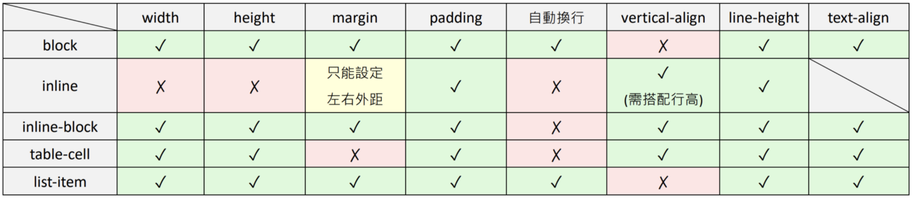

# 盒子模型 (The box model)

## 正常佈局流

## 塊級元素

-   display: block;
-   自成一行
-   可以設置 width, height
-   寬度缺省是父容器的 100%
-   可以設置 padding, margin, border, 會移動其他元素

## 內聯元素

-   display: inline;
-   空間不足才換行
-   無法設置 width, height
-   寬度是盒子內的文字或圖片的寬度
-   可以設置 padding, margin, border, 會移動其他元素（水平）

## 內聯塊級元素

-   display: inline-block;
-   空間不足才換行的塊級元素

## 浮動元素

-   脫離正常佈局流
-   吸附到父容器的左（右）邊
-   可以設置 width, height
-   寬度高度缺省是元素內的文字或圖片的寬度高度
-   在浮動元素後, 且處於正常佈局流中的元素, 會圍繞者浮動元素填滿右（左）側空間
-   有 clear 的元素會停止浮動 (後續元素變回正常佈局流, 直到遇到新的浮動元素)
-   float: left;
-   float: right;
-   clear: left;
-   clear: right;
-   clear: both;
-   warning
    -   浮動元素在父元素中所佔的有效高度為 0 (清除浮動後才有高度)
    -   非浮動元素的 margin 不能用來和浮動元素之間製造空間

## 列表

-   display: list-item
-   可搭配其他 list 屬性 （ex: list-style)
-   以條列式顯示的塊級元素

---

#### 行高設置

-   line-height: normal | \<number> | \<length> | \<percentage>

#### 總結

[Demo](https://codepen.io/zero3william/pen/JjrLgKL)
