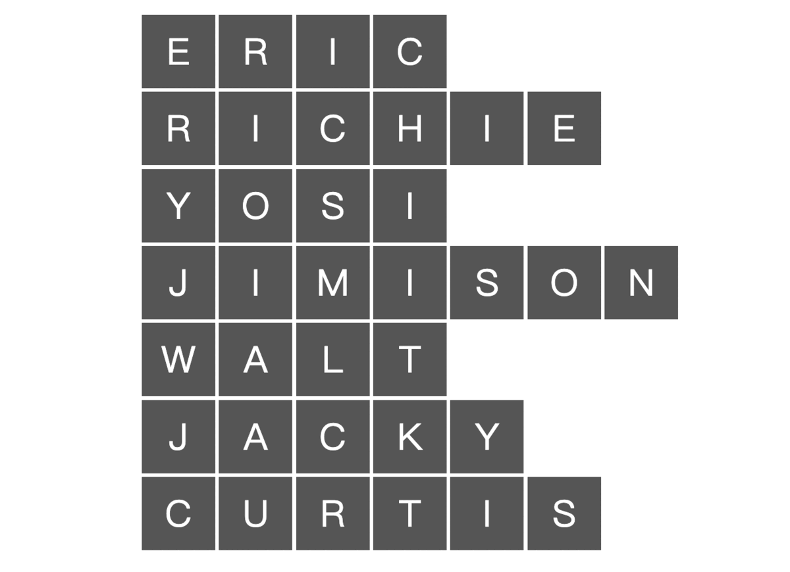

# 彈性盒子

#### [誕生原因](#誕生原因)

#### [主要思想](#主要思想)

#### [基礎知識和名詞](#基礎知識和名詞)

#### [彈性容器屬性](#彈性容器屬性)

#### [彈性項目屬性](#彈性項目屬性)

#### [佈局練習](#佈局練習)

#### [進階挑戰](#進階挑戰)

#### [青娃回家小遊戲](http://flexboxfroggy.com/#zh-tw)

#### [彈性盒子塔防](http://www.flexboxdefense.com/)

#### [彈性海盜](https://hexschool.github.io/flexbox-pirate)

---

## 誕生原因

-   block 基於垂直排列
-   inline 基於水平排列
-   提供一種更敏捷的對齊和佈局方式，即使內容的大小未知（動態）

## 主要思想

容器內的項目能動態改變

1. 寬度
2. 高度
3. 順序

適合開發組件或小規模佈局

## 基礎知識和名詞

-   flex container: 彈性容器，包含彈性項目的父元素 （display: flex | inline-flex)
-   flex items: 彈性項目，彈性容器的直接後代都會變成彈性項目
-   彈性容器有兩個軸(axes)
    1. main axis: 主軸，跟隨彈性項目順序的軸
    2. cross axis: 切軸，與主軸垂直
-   directions: 主軸的方向（水平或垂直）


## 彈性容器屬性


-   display

    ```css
    /* 定義一個彈性容器，容器可以是block or inline-block */
    .container {
        display: flex; /* or inline-flex */
    }
    ```

-   flex-direction

    ```css
    /* 主軸方向 */
    .container {
        flex-direction: row | row-reverse | column | column-reverse;
    }
    ```

      

-   flex-wrap

    ```css
    /* 
        nowrap: 不換行
        wrap: 上到下（左到右）換行
        wrap-reverse: 下到上（右到左）換行
    */
    .container {
        flex-wrap: nowrap | wrap | wrap-reverse;
    }
    ```

      

-   flex-flow

    ```css
    /* flex-direction & flex-wrap 簡寫 */
    .container {
        flex-flow: row nowrap; /* 默認值 */
    }
    ```

-   justify-content

    ```css
    /* 主軸對齊方式 */
    .container {
        justify-content: flex-start | flex-end | center | space-between |
            space-around | space-evenly |...;
    }
    ```

      

-   align-items

    ```css
    /* 切軸對齊方式 */
    .container {
        align-items: flex-start | flex-end | center | stretch | baseline |...;
    }
    ```

      

-   align-content

    ```css
    /* (wrap | wrap-reverse) && 切軸上有額外空間時 */
    .container {
        align-content: flex-start | flex-end | center | stretch | space-between
            | space-around |...;
    }
    ```

      

-   gap

    ```css
    /* 彈性項目之間的最小空間 */
    .container {
        display: flex;
        gap: 10px;
        gap: 10px 20px; /* row-gap column gap */
        row-gap: 10px;
        column-gap: 20px;
    }
    ```

## 彈性項目屬性


-   order

    ```css
    /* 
        彈性項目默認按源順序排列。
        order 可控制彈性項目在彈性容器中出現的順序
    */
    .item {
        order: 5; /* default is 0 */
    }
    ```

    

-   flex-grow

    ```css
    /* 
        定義彈性項目在必要時增長的能力。
        接受用作比例的無單位值。
        規定了項目應該佔用的彈性容器內的可用空間量。
    
        如果所有項目都flex-grow設置為1，
        則容器中的剩餘空間將平均分配給所有子項。
        
        如果其中一個孩子的值為2，
        則該孩子將佔用其他孩子之一的兩倍空間。
    
        負數無效
    */
    .item {
        flex-grow: 4; /* default 0 */
    }
    ```

    

-   flex-shrink

    ```css
    /* 
        彈性收縮
        定義彈性項目在必要時收縮的能力。
    */
    .item {
        flex-shrink: 3; /* default 1 */
    }
    ```

-   align-items

    ```css
    /* align-self 為單個彈性項目覆蓋對齊方式 */
    .item {
        align-self: auto | flex-start | flex-end | center | stretch | baseline;
    }
    ```

      

### 佈局練習


-   [前往挑戰](https://codepen.io/zero3william/pen/VwrbbVz)

### 進階挑戰



-   [前往挑戰](https://codepen.io/zero3william/pen/qBVmreE)
