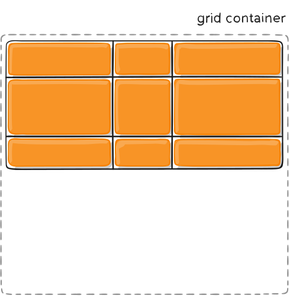
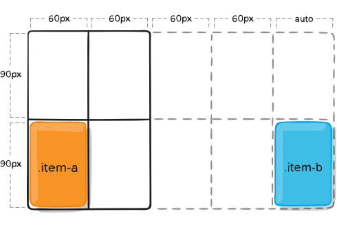
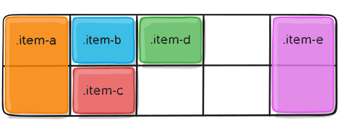

# Grid

### 基於二維網格的佈局系統

### 專門為解決佈局問題而創建的 CSS 模塊

---

-   [基礎知識和名詞](#基礎知識和名詞)
-   [網格屬性](#網格屬性)
-   [Special Units & Functions](#Special-Units-&-Functions)
-   [網格花園](http://cssgridgarden.com/#zh-tw)

---

## 基礎知識和名詞

-   grid container: 網格容器。包含網格項目的父元素 （display: grid | inline-grid)
-   grid item: 網格項目。網格容器的直接後代都會變成網格項目
-   grid line: 網格線。構成網格結構的分割線
    1. column grid lines: 垂直線
    2. row grid lines: 水平線
-   grid cell: 網格單元。兩個相鄰 row grid lines 和 兩個相鄰 column grid lines 之間的空間。

    

-   grid track: 網格軌道。兩個相鄰 grid lines 之間的空間。

    

-   grid area: 網格區域。

    

## 網格屬性

-   Grid Continaer's property

    -   [display](#display)
    -   [grid-template-columns](#grid-template-columns)
    -   [grid-template-rows](#grid-template-rows)
    -   [grid-template-areas](#grid-template-areas)
    -   [grid-template](#grid-template)
    -   [grid-column-gap](#grid-column-gap)
    -   [grid-row-gap](#grid-row-gap)
    -   [grid-gap](#grid-gap)
    -   [justify-items](#justify-items)
    -   [align-items](#align-items)
    -   [place-items](#place-items)
    -   [justify-content](#justify-content)
    -   [align-content](#align-content)
    -   [place-content](#place-content)
    -   [grid-auto-columns](#grid-auto-columns)
    -   [grid-auto-rows](#grid-auto-rows)
    -   [grid-auto-flow](#grid-auto-flow)
    -   [grid](#grid)

-   Grid Item's property
    -   [grid-column-start](#grid-column-start)
    -   [grid-column-end](#grid-column-end)
    -   [grid-row-start](#grid-row-start)
    -   [grid-row-end](#grid-row-end)
    -   [grid-column](#grid-column)
    -   [grid-row](#grid-row)
    -   [grid-area](#grid-area)
    -   justify-self
    -   align-self
    -   place-self

### Grid Container Property

-   ### display

    ```css
    /*
        grid – 生成塊級網格
        inline-grid – 生成內聯級網格
    */
    .container {
        display: grid | inline-grid;
    }
    ```

-   ### grid-template-columns

-   ### grid-template-rows

    ```css
    .container {
        grid-template-columns: ... ...;
        /* e.g.
            1fr 1fr
            minmax(10px, 1fr) 3fr
            repeat(5, 1fr)
            50px auto 100px 1fr
        */
        grid-template-rows: ... ...;
        /* e.g.
            min-content 1fr min-content
            100px 1fr max-content
        */
    }
    .container {
        grid-template-columns: [first] 40px [line2] 50px [line3] auto [col4-start] 50px [five] 40px [end];
        grid-template-rows: [row1-start] 25% [row1-end] 100px [third-line] auto [last-line];
    }
    ```

      

-   ### grid-template-areas

    ```css
    .item-a {
        grid-area: header;
    }
    .item-b {
        grid-area: main;
    }
    .item-c {
        grid-area: sidebar;
    }
    .item-d {
        grid-area: footer;
    }
    .container {
        display: grid;
        grid-template-columns: 50px 50px 50px 50px;
        grid-template-rows: auto;
        grid-template-areas:
            'header header header header'
            'main main . sidebar'
            'footer footer footer footer';
    }
    ```

      

-   ### grid-template

    A shorthand for setting grid-template-rows, grid-template-columns, and grid-template-areas in a single declaration.

    ```css
    .container {
        grid-template:
            [row1-start] 'header header header' 25px [row1-end]
            [row2-start] 'footer footer footer' 25px [row2-end]
            / auto 50px auto;
    }
    /* equivalent */
    .container {
        grid-template-rows: [row1-start] 25px [row1-end row2-start] 25px [row2-end];
        grid-template-columns: auto 50px auto;
        grid-template-areas:
            'header header header'
            'footer footer footer';
    }
    ```

-   ### column-gap (standard)
-   ### row-gap (standard)
-   ### grid-column-gap (old)
-   ### grid-row-gap (old)

    ```css
    .container {
        grid-template-columns: 100px 50px 100px;
        grid-template-rows: 80px auto 80px;
        column-gap: 10px;
        row-gap: 15px;
    }
    ```

    

-   ### gap (standard)
-   ### grid-gap (old)

    A shorthand for row-gap and column-gap

    ```css
    .container {
        gap: <grid-row-gap> <grid-column-gap>;
    }
    ```

-   ### justify-items

    也可以通過 justify-self 屬性在單個網格項上設置此行為。

    ```css
    .container {
        justify-items: start | end | center | stretch;
    }
    ```

    
    
    
    

-   ### align-items

    也可以通過 align-self 屬性在單個網格項上設置此行為。

    ```css
    .container {
        align-items: start | end | center | stretch;
    }
    ```

    
    
    
    

-   ### place-items

    在單個聲明中 設置 align-items 和 justify-items

    ```css
    .container {
        display: grid;
        place-items: <align-items> / <justify-items>;
        /* 如果省略第二個值，則將第一個值分配給兩個屬性 */
    }
    ```

-   ### justify-content

    ```css
    .container {
        justify-content: start | end | center | stretch | space-around |
            space-between | space-evenly;
    }
    ```

     
     
     
     
     
     
     

-   ### align-content

    ```css
    .container {
        align-content: start | end | center | stretch | space-around |
            space-between | space-evenly;
    }
    ```

    
    
    
    
    
    
    

-   ### place-content

    在單個聲明中 設置 align-content 和 justify-content

    ```css
    .container {
        display: grid;
        place-content: <align-content> / <justify-content>;
        /* 如果省略第二個值，則將第一個值分配給兩個屬性 */
    }
    ```

-   ### grid-auto-columns
-   ### grid-auto-rows

    ```css
    .container {
        grid-template-columns: 60px 60px;
        grid-template-rows: 90px 90px;
        grid-auto-columns: 60px;
    }
    .container .item-a {
        grid-column: 1 / 2;
        grid-row: 2 / 3;
    }
    .container .item-b {
        grid-column: 5 / 6;
        grid-row: 2 / 3;
    }
    ```

    

-   ### grid-auto-flow

    ```css
    .container {
        display: grid;
        grid-template-columns: 60px 60px 60px 60px 60px;
        grid-template-rows: 30px 30px;
        grid-auto-flow: row;
    }
    .container .item-a {
        grid-column: 1;
        grid-row: 1 / 3;
    }
    .container .item-e {
        grid-column: 5;
        grid-row: 1 / 3;
    }
    ```

    

    ```css
    .container {
        display: grid;
        grid-template-columns: 60px 60px 60px 60px 60px;
        grid-template-rows: 30px 30px;
        grid-auto-flow: column;
    }
    .container .item-a {
        grid-column: 1;
        grid-row: 1 / 3;
    }
    .container .item-e {
        grid-column: 5;
        grid-row: 1 / 3;
    }
    ```

    

-   ### grid

    A shorthand for setting all of the following properties in a single declaration:

    -   grid-template-rows
    -   grid-template-columns
    -   grid-template-areas
    -   grid-auto-rows
    -   grid-auto-columns
    -   grid-auto-flow
    -   (Note: You can only specify the explicit or the implicit grid properties in a single grid declaration)

### Grid Item Property

-   ### grid-column-start
-   ### grid-column-end
-   ### grid-row-start
-   ### grid-row-end

    ```css
    .item-a {
        grid-column-start: 2;
        grid-column-end: five;
        grid-row-start: row1-start;
        grid-row-end: 3;
    }
    ```

    

    ```css
    .item-b {
        grid-column-start: 1;
        grid-column-end: span col4-start;
        grid-row-start: 2;
        grid-row-end: span 2;
    }
    ```

    

-   ### grid-column
-   ### grid-row

    Shorthand for grid-column-start + grid-column-end, and grid-row-start + grid-row-end, respectively.

    ```css
    .item-c {
        grid-column: 3 / span 2;
        grid-row: third-line / 4;
    }
    ```

      

-   ### grid-area

    ```css
    .item {
        grid-area: <name> | <row-start> / <column-start> / <row-end> /
            <column-end>;
    }
    .item-d {
        grid-area: 1 / col4-start / last-line / 6;
    }
    ```

    

### Special-Units-&-Functions

-   fr units

    ```css
    grid-template-columns: 1fr 3fr;
    grid-template-columns: 50px min-content 1fr;
    ```

-   minmax()

    ```css
    grid-template-columns: minmax(100px, 1fr) 3fr;
    ```

-   repeat()

    ```css
    grid-template-columns: 1fr 1fr 1fr 1fr 1fr 1fr 1fr 1fr;
    grid-template-columns: repeat(8, 1fr);
    grid-template-columns: repeat(8, minmax(10px, 1fr));
    ```

[Demo](https://codepen.io/zero3william/pen/BamdMBK)